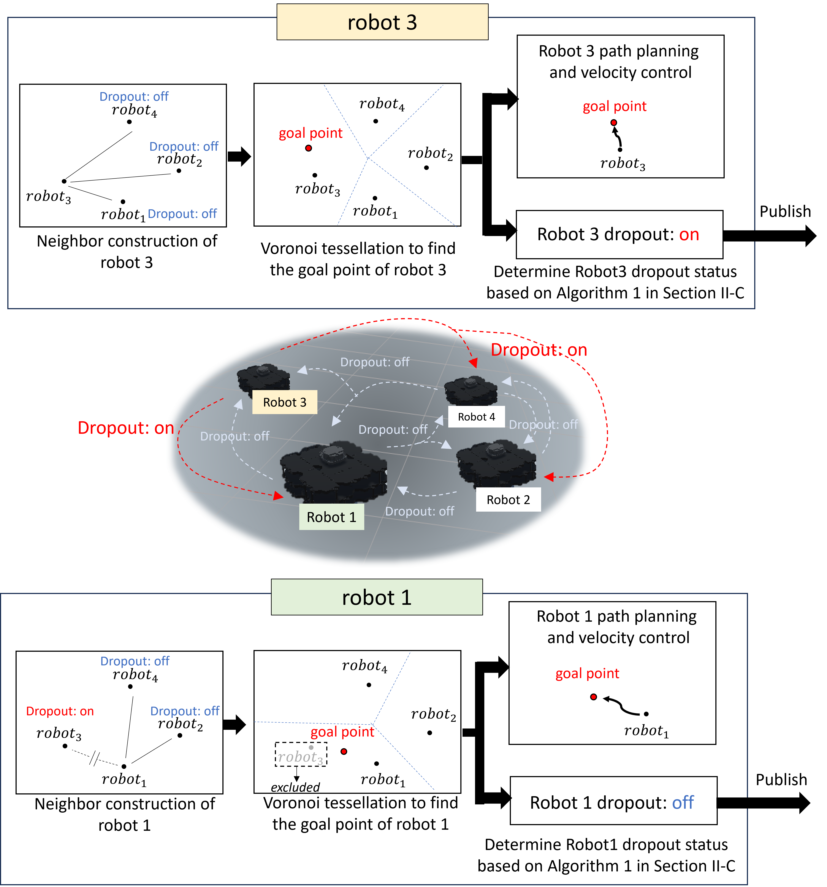
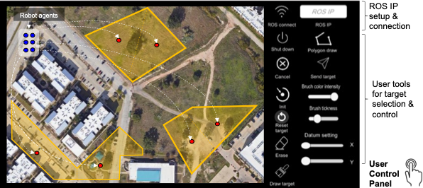

<h1>Decentralized Multi-Robot Coverage Control via Self-Dropout and Voronoi Tessellation</h1>

## Overview

The presented method improves the distribution of Voronoi regions and the coverage of target domains in a computationally efficient and scalable manner. 
This algorithm is implemented in various coverage control scenarios involving homogeneous and heterogeneous multi-robot teams in a  Unity-ROS simulation environment. 
The results show that the self-dropout technique improves the overall coverage performance of CVT compared to the method without adopting this technique. 
In addition, its decentralized scheme makes the algorithm scalable and reliable under intermittent communication among the robots.  
A user interface (UI) is developed for simulations and potential use in physical multi-robot systems. 
This UI allows users to import a map or a model of an environment, define target areas within the environment using embedded drawing tools, and execute multi-robot coverage control tasks. 



## User interface





Environment: ROS2 humble

## Download simulator
```
git clone https://github.com/KangneoungLee/DecentVoronoi.git
```

## UI program
```
Open ui folder and execute coverage_control_UI_v1.exe. 
It was built from Unity 2D game

Set up a proper IP address for ROS2 connection
```


## Vritual robot and decentralized coverage control
```

cd DecentVoronoi
colcon build --symlink-install
source install/setup.bash
ros2 launch decent_main_launch decent_voro.launch.py   

open another terminal

set up a proper IP address in DecentVoronoi/src/ros_tcp_endpoint_main_ros2/launch/endpoint.launch.py for UI connection

cd DecentVoronoi
source install/setup.bash
ros2 launch ros_tcp_endpoint_main_ros2 endpoint.launch.py
```